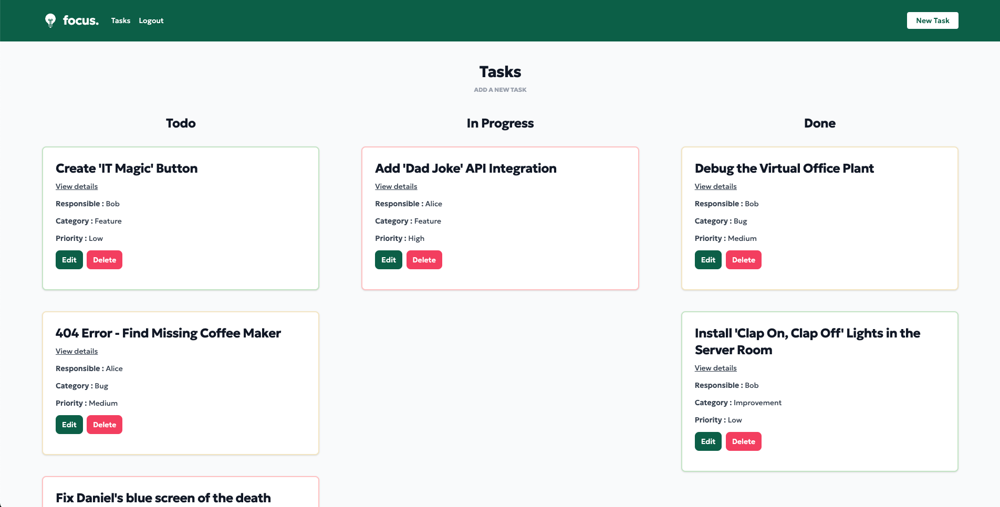

# Collaborative task manager : focus.

[Click here](https://focus.adaptable.app/) to test the app !

## I. Project outlining

### a) Objective

- Create a small fullstack app in JS with two models and CRUD
- Second project during the Ironhack Bootcamp

### b) Constraints

- Duo project, managing merge conflicts
- The app had to be responsive and produced in less than a week
- Only Javascript with Express, Node.js, Handlebar, MongoDB and Tailwind CSS

### c) The app concept

The app is heavily inspired by Trello, the classic Kanban app.

You can view the tasks, sorted in column regarding of their state (Todo, In Progress, Done).

Il you register (with auto login) you can then edit/delete some tasks, create new ones and attribue them to others users.

[Have a try](https://focus.adaptable.app/)

## II. Milestones

### Step 1

- Initial setup with Ironlauncher
- Add models (Users & Tasks)

### Step 2

- Add the view tasks route
- Create de .hbs views
- Create the .hbs layout with the navbar

### Step 3

- Add a route to delete tasks
- Add routes to create, edit and delete tasks

### Step 4

- Display the tasks in differents section on the homepage
- Implement Tailwind CSS

### Step 5

- Add preselection of the fields when editing

### Step 6

- Change the header links regarding if the user is logged or not
- Add auto login when registering

## III. Acknowledgements

### Teachers at IronHack

- Luis Junco
- Alessandra Scarpellini
- Daniel Skonetzky
